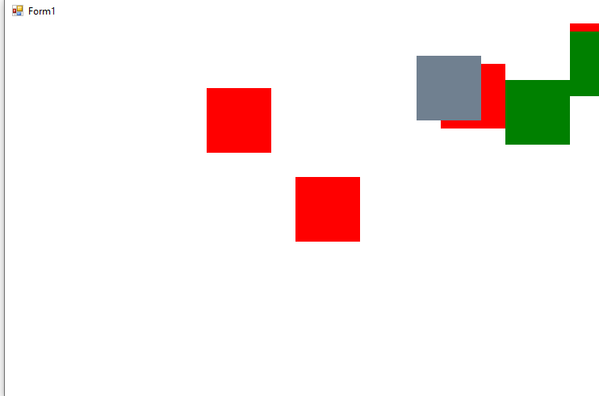
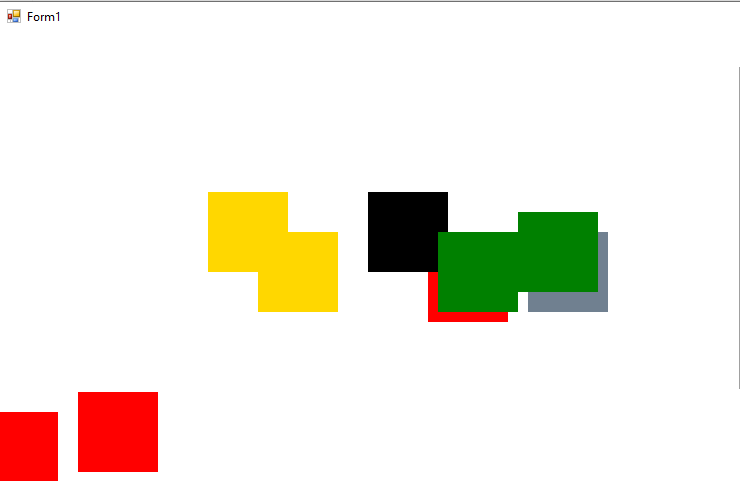
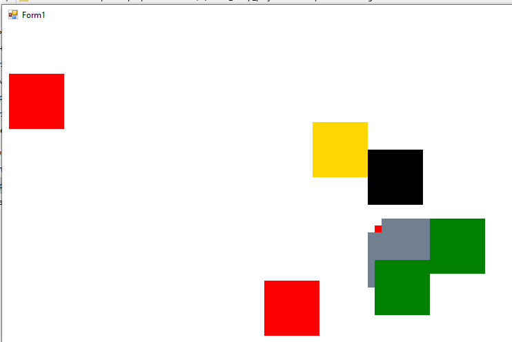

# Simple-Genetic-Algorithm
implementation of genetic algorithm with visualization

Workflow:
1)Firstly, the program creates squares with different colors.  
2)Then they are moving across the area of the window  
3)When some of them intersect each other -> program create a descendant with color generated via a genetic algorithm  
4)As a result all new squares have new colors  
5)After a while, all entities die  

Exmaples of work: 

