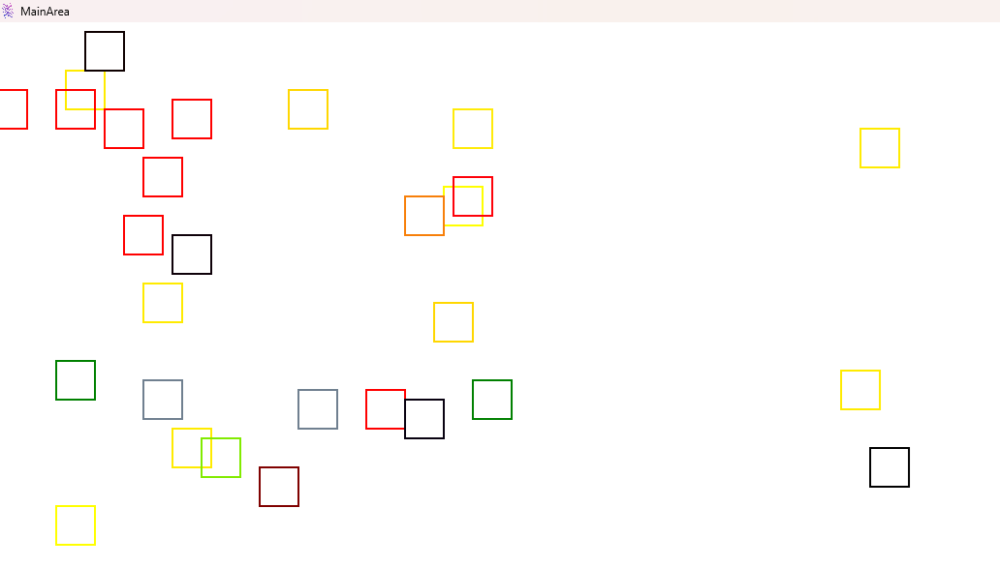

# Simple-Genetic-Algorithm
Implementation of genetic algorithm with visualization

Workflow:
 
1) Firstly, the program creates squares with different colors.  
2) Then they are moving across the area of the window  
3) When some of them intersect each other -> program create a descendant with color generated via a genetic algorithm  
4) As a result all new squares have new colors  
5) After a while, all entities die  

Examples of running program: 

TODO: 

 - Update movement of items, not just liner but make them gravitate across area.
 - Use abstraction for Paint, Color, Pen and Rectangle in Domain lib. Implement these abstraction for every UI lib separately
 - Change shape to circles.
 - Replace WinForms with WPF.
